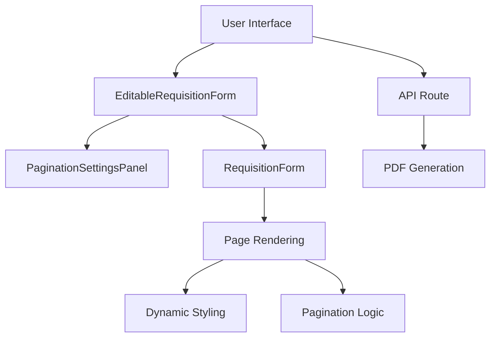
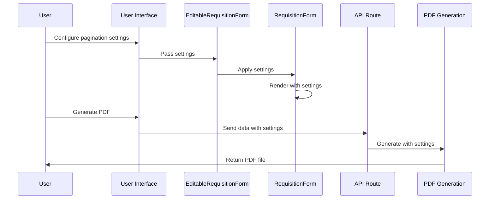
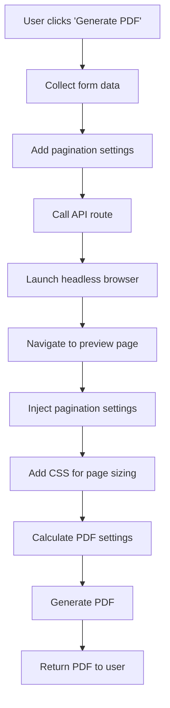
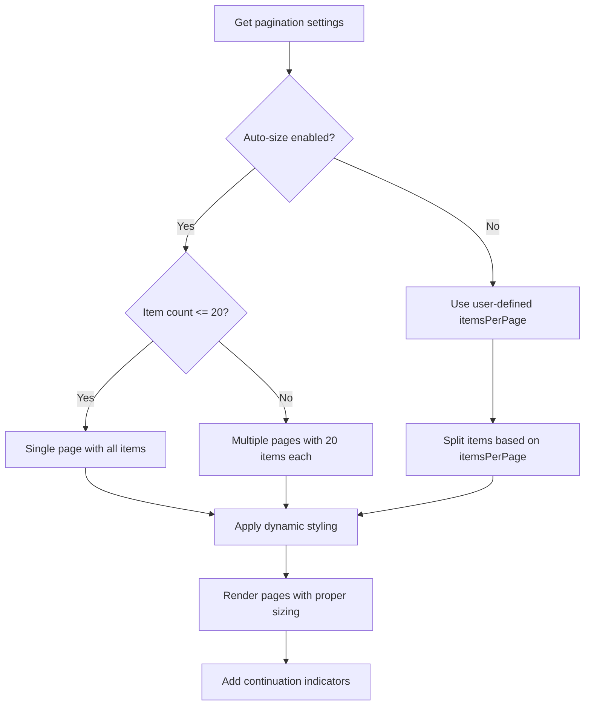
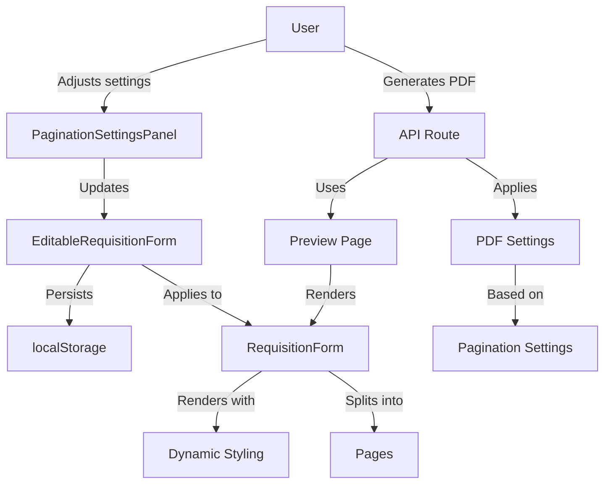

# Dynamic User PDF Layout Adjustment: Technical Summary

This document provides a comprehensive overview of the implementation for dynamic user-controlled PDF layout adjustment, focusing on the key areas where sizing and formatting are handled.

## System Architecture



## Data Flow



## Key Components and Responsibilities

### 1. PaginationSettingsPanel (`PaginationSettingsPanel.tsx`)

**Purpose**: Provides UI controls for users to configure pagination settings.

**Key Features**:
- Toggle between auto-sizing and manual pagination
- Slider for setting items per page
- Real-time preview of page count

**Code Structure**:
```typescript
interface PaginationSettings {
  itemsPerPage: number;
  autoSize: boolean;
}

const PaginationSettingsPanel: FC<{
  settings: PaginationSettings;
  onSettingsChange: (settings: PaginationSettings) => void;
  totalItems: number;
}> = ({ settings, onSettingsChange, totalItems }) => {
  // UI controls for pagination settings
}
```

### 2. RequisitionForm Component (`RequisitionForm.tsx`)

**Purpose**: Renders the requisition form with dynamic pagination and styling.

**Key Areas**:

#### 2.1 Pagination Logic
```typescript
// Split items into pages based on user settings
const pages = useMemo(() => {
  // If auto-size is enabled or no pagination settings provided
  if (!paginationSettings || paginationSettings.autoSize) {
    // Logic for auto-sizing
  } else {
    // Logic for manual pagination using itemsPerPage
  }
}, [line_items, paginationSettings]);
```

#### 2.2 Dynamic Styling Functions
```typescript
// Calculate row height based on items per page
const getRowHeightClass = useMemo(() => {
  const currentPageItemCount = pages.length > 0 ? pages[0].length : 0;
  
  if (currentPageItemCount <= 5) return "py-1.5";
  else if (currentPageItemCount <= 7) return "py-1";
  // Additional conditions...
}, [pages]);

// Similar functions for font size, spacing, padding, etc.
```

#### 2.3 Page Rendering
```typescript
const renderPage = (pageItems: LineItem[], pageIndex: number, isLastPage: boolean) => {
  const isFirstPage = pageIndex === 0;
  const hasMorePages = pageIndex < pages.length - 1;
  
  return (
    <div>
      {/* Page container with sizing controls */}
      <div 
        style={{ height: 'auto', maxHeight: '8.5in', overflow: 'hidden' }}
        className={`w-[11in] bg-white p-4 rounded-lg shadow-lg mx-auto ${pageIndex > 0 ? 'page-break-before' : ''}`}
      >
        {/* Content */}
        
        {/* Continuation indicator */}
        {hasMorePages && (
          <div className="text-center py-2 bg-gray-50 border-t border-gray-200 print:block">
            <p className="text-sm font-medium text-gray-700">
              (Continued on next page)
            </p>
          </div>
        )}
      </div>
    </div>
  );
};
```

### 3. EditableRequisitionForm Component (`EditableRequisitionForm.tsx`)

**Purpose**: Provides edit and preview modes for the requisition form, with pagination settings.

**Key Features**:
- Toggle between edit and preview modes
- Manage pagination settings
- Persist settings in localStorage

```typescript
// Hook for persisting pagination settings
function usePaginationSettings(initialSettings: PaginationSettings) {
  const [settings, setSettings] = useState<PaginationSettings>(() => {
    // Load from localStorage if available
  });
  
  // Save to localStorage when settings change
  useEffect(() => {
    localStorage.setItem('paginationSettings', JSON.stringify(settings));
  }, [settings]);
  
  return [settings, setSettings];
}

export function EditableRequisitionForm({ 
  formData, 
  onUpdate, 
  onPaginationSettingsChange,
  initialPaginationSettings
}) {
  // State for pagination settings
  const [paginationSettings, setPaginationSettings] = usePaginationSettings(
    initialPaginationSettings || {
      itemsPerPage: Math.min(10, Math.max(1, data.line_items.length)),
      autoSize: true
    }
  );
  
  // Notify parent component when settings change
  useEffect(() => {
    if (onPaginationSettingsChange) {
      onPaginationSettingsChange(paginationSettings);
    }
  }, [paginationSettings, onPaginationSettingsChange]);
  
  // Render preview with pagination settings
  const renderPreview = () => (
    <RequisitionForm {...data} paginationSettings={paginationSettings} />
  );
}
```

### 4. Requisition Preview Page (`requisition-preview/page.tsx`)

**Purpose**: Standalone page for previewing and printing the requisition form.

**Key Features**:
- Apply pagination settings from URL parameters
- Provide print-specific CSS
- Handle dynamic settings updates

```typescript
export default function RequisitionPreview({ searchParams }) {
  // Parse form data from URL parameters
  const formData = searchParams.data ? JSON.parse(decodeURIComponent(searchParams.data)) : {};
  
  // Initialize pagination settings from URL parameters
  const [paginationSettings, setPaginationSettings] = usePaginationSettings(
    formData.paginationSettings || {
      itemsPerPage: Math.min(10, Math.max(1, lineItemCount)),
      autoSize: true
    }
  );
  
  // Listen for custom events from the API route
  useEffect(() => {
    const handlePaginationSettingsUpdate = (event: CustomEvent) => {
      setPaginationSettings(event.detail);
    };
    
    // Add event listener and check for data attribute
  }, [setPaginationSettings]);
  
  return (
    <>
      <style jsx global>{`
        @page {
          size: letter landscape;
          margin: 0.1in;
        }
        
        @media print {
          /* Print-specific CSS */
          
          /* Fix for card overflow */
          [data-testid^="requisition-form"] {
            height: auto !important;
            max-height: 8.3in !important;
            overflow: hidden !important;
            page-break-after: always;
            break-after: page;
          }
          
          /* Last page should not force a page break after */
          [data-testid="requisition-form"]:last-of-type,
          [data-testid^="requisition-form-page"]:last-of-type {
            page-break-after: avoid;
            break-after: avoid;
          }
        }
      `}</style>
      
      {/* Form with pagination settings */}
      <RequisitionForm {...formData} paginationSettings={paginationSettings} />
    </>
  );
}
```

### 5. PDF Generation API Route (`api/generate-requisition/route.ts`)

**Purpose**: Generates PDF from the requisition form with user-defined pagination settings.

**Key Areas**:

#### 5.1 PDF Settings Calculation
```typescript
function calculatePdfSettings(data: RequisitionFormProps) {
  // Base settings
  const settings = {
    format: 'Letter' as const,
    landscape: true,
    printBackground: true,
    preferCSSPageSize: true,
    margin: { top: '0.1in', right: '0.1in', bottom: '0.1in', left: '0.1in' },
    scale: 0.98,
    displayHeaderFooter: false
  };

  // Get effective items per page based on pagination settings
  let effectiveItemsPerPage = itemCount;
  
  if (data.paginationSettings) {
    const { autoSize, itemsPerPage } = data.paginationSettings;
    
    // Determine effective items per page based on settings
  }

  // Adjust scale and margins based on effective items per page
  if (effectiveItemsPerPage > 15) {
    settings.scale = 0.94;
    // Adjust margins
  } else if (effectiveItemsPerPage > 10) {
    settings.scale = 0.96;
    // Adjust margins
  } else if (effectiveItemsPerPage >= 8 && effectiveItemsPerPage <= 9) {
    settings.scale = 0.97;
    // Adjust margins
  }

  return settings;
}
```

#### 5.2 PDF Generation Process
```typescript
export async function POST(req: NextRequest) {
  // Parse request data
  const data: RequisitionFormProps = await req.json();
  
  // Launch browser
  const browser = await chromium.launch();
  const context = await browser.newContext();
  const page = await context.newPage();
  
  // Set viewport size
  await page.setViewportSize({ width: 1280, height: 800 });
  
  // Navigate to preview page with data
  await page.goto(`${baseUrl}/requisition-preview?data=${encodeURIComponent(JSON.stringify(data))}`);
  
  // Inject script to apply pagination settings
  await page.evaluate((paginationSettings) => {
    // Apply settings to the page
    
    // Add additional CSS for page sizing
    const style = document.createElement('style');
    style.textContent = `
      @media print {
        [data-testid^="requisition-form"] {
          height: auto !important;
          max-height: 8.3in !important;
          overflow: hidden !important;
          page-break-after: always;
          break-after: page;
        }
        
        [data-testid="requisition-form"]:last-of-type,
        [data-testid^="requisition-form-page"]:last-of-type {
          page-break-after: avoid;
          break-after: avoid;
        }
      }
    `;
    document.head.appendChild(style);
  }, data.paginationSettings);
  
  // Generate PDF with calculated settings
  const pdfSettings = calculatePdfSettings(data);
  const pdf = await page.pdf(pdfSettings);
  
  // Return PDF
  return new NextResponse(pdf, {
    headers: {
      'Content-Type': 'application/pdf',
      'Content-Disposition': `attachment; filename="${filename}"`,
      // Additional headers
    }
  });
}
```

## Critical CSS Properties for Page Sizing and Breaks

| Property | Value | Purpose |
|----------|-------|---------|
| `height` | `auto` | Allow content to determine height |
| `maxHeight` | `8.5in` | Prevent overflow beyond page height |
| `overflow` | `hidden` | Prevent content from spilling over |
| `page-break-before` | `always` | Force page break before element |
| `page-break-after` | `always`/`avoid` | Control page breaks after element |
| `break-after` | `page`/`avoid` | Modern alternative to page-break-after |
| `transform` | `scale(0.97)` | Adjust overall scaling for better fit |
| `transform-origin` | `top center` | Control scaling origin point |

## Process Flow: PDF Generation



## Process Flow: Pagination Logic



## Key Interactions Between Components



## Conclusion

The dynamic user PDF layout adjustment implementation spans multiple components with specific responsibilities:

1. **User Interface Components**:
   - `PaginationSettingsPanel`: Provides controls for user configuration
   - `EditableRequisitionForm`: Manages edit/preview modes and settings persistence

2. **Rendering Components**:
   - `RequisitionForm`: Handles pagination logic and dynamic styling
   - Page rendering with proper sizing and continuation indicators

3. **PDF Generation**:
   - API route for generating PDFs with user settings
   - Dynamic PDF settings calculation based on content and user preferences
   - CSS injection for consistent sizing and page breaks

The system ensures that pagination settings are properly applied throughout the process, from user configuration to final PDF output, providing a consistent experience between what users see in the preview and what appears in the generated PDF. 